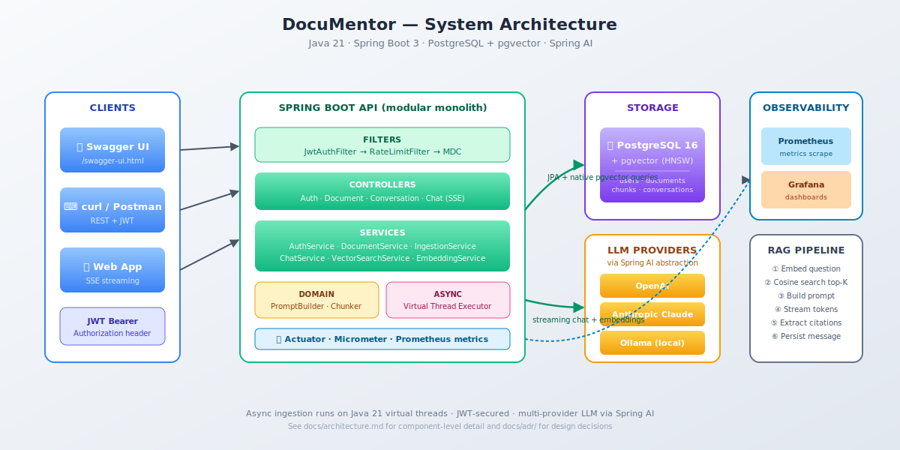
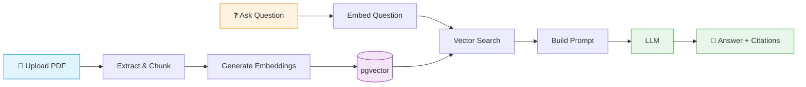
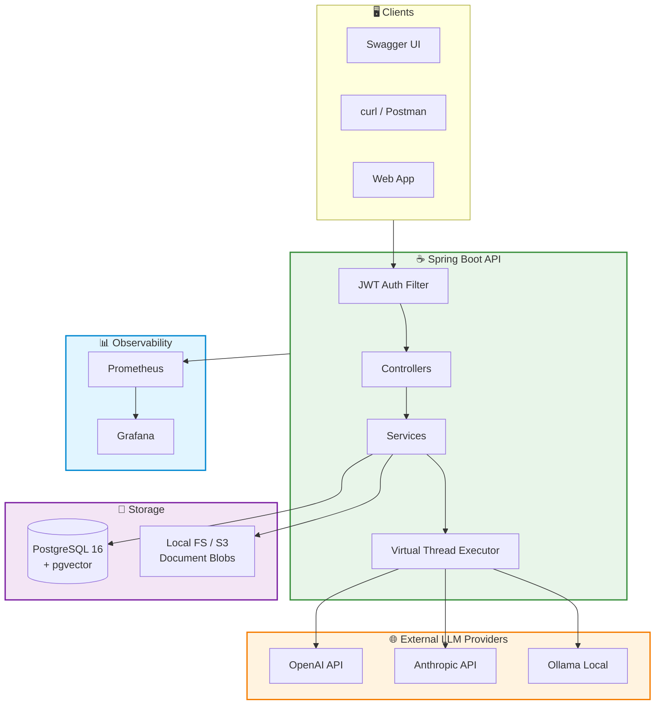
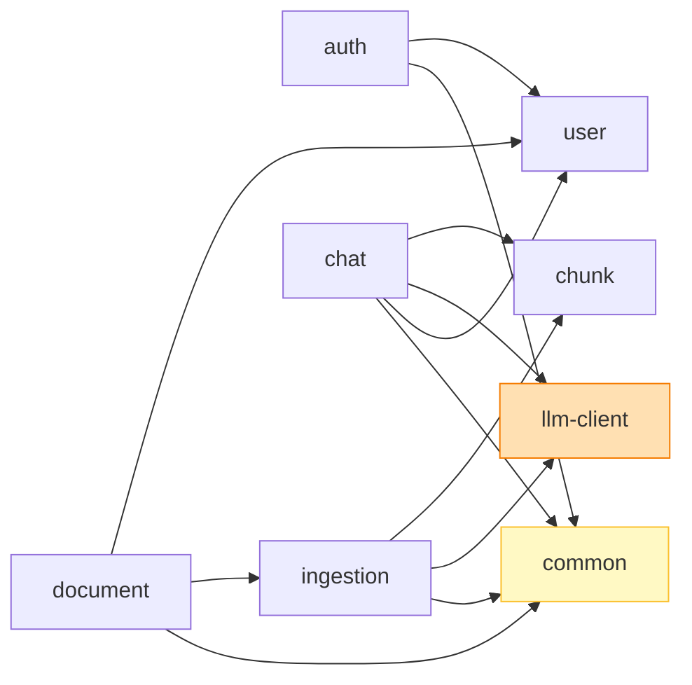
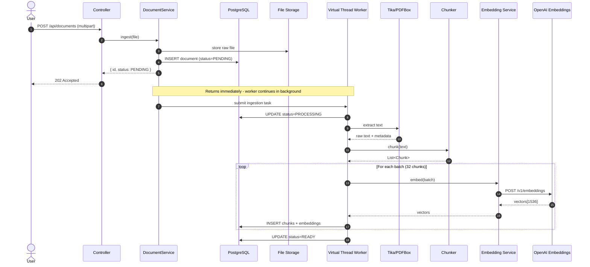
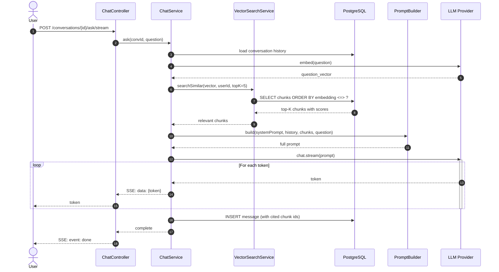
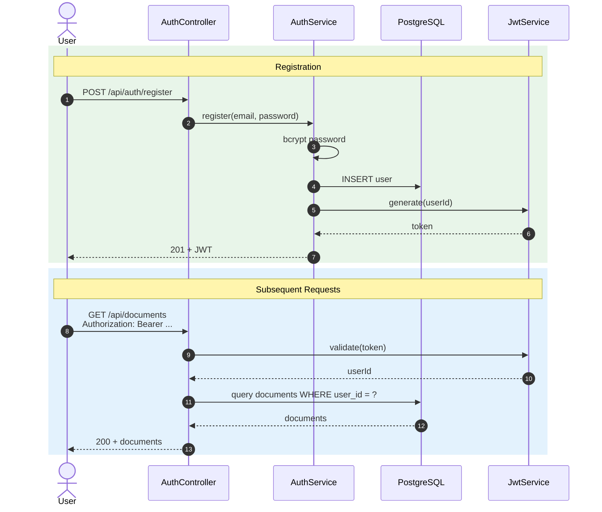
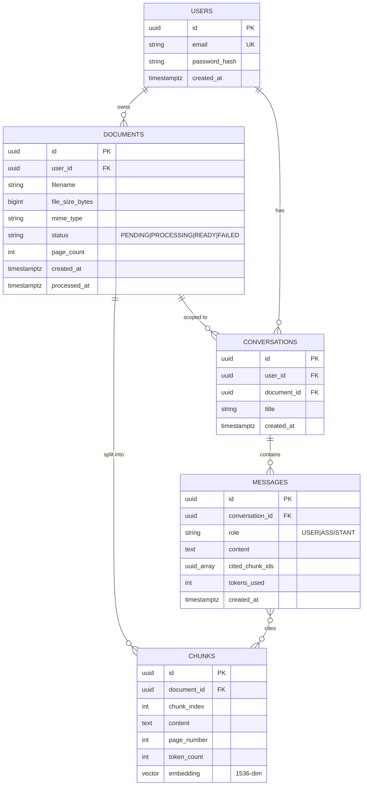
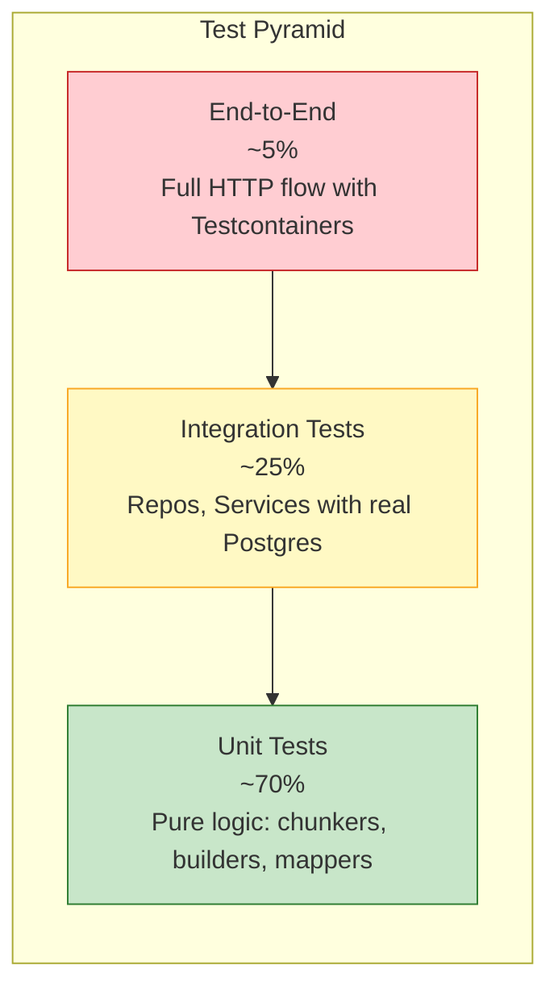
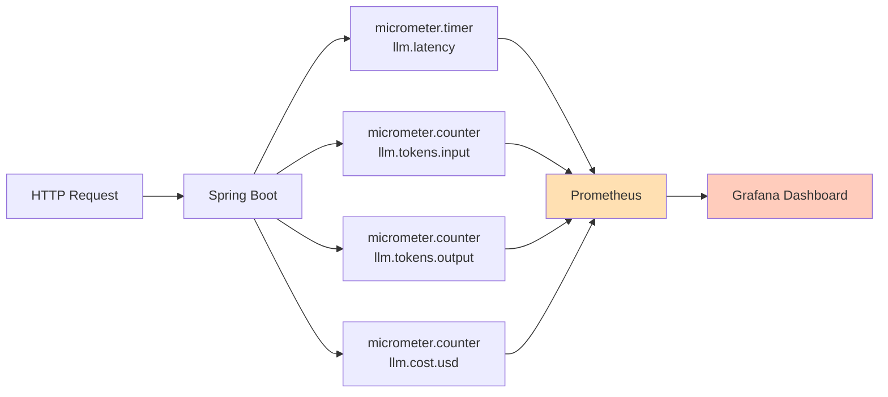

# 📚 DocuMentor

> **Production-grade RAG API for document question-answering.** Upload PDFs, ask questions in natural language, get answers with citations grounded in your documents.

<p align="center">
  
</p>

<p align="center">
  <a href="#-features">Features</a> •
  <a href="#-quick-start">Quick Start</a> •
  <a href="#-architecture">Architecture</a> •
  <a href="#-api">API</a> •
  <a href="#-design-decisions">Design Decisions</a> •
  <a href="#-roadmap">Roadmap</a>
</p>

<p align="center">
  
  
  
  
  
  
</p>

---

## 🎯 What it does

DocuMentor lets users upload documents (PDF, DOCX, TXT) and ask questions about them in natural language. Answers are **grounded in the source material** — every response includes citations pointing back to the exact passages used.

Under the hood, it's a textbook implementation of **Retrieval-Augmented Generation (RAG)**:



---

## ✨ Features

- 🔐 **JWT authentication** with per-user document isolation
- 📄 **Multi-format ingestion** — PDF, DOCX, TXT via Apache Tika
- 🧠 **Token-aware chunking** with configurable overlap
- 🔍 **Semantic search** via pgvector HNSW indexes
- 💬 **Streaming responses** over Server-Sent Events
- 📑 **Citation extraction** — every claim links to source chunks
- 🔄 **Multi-provider LLM** support (OpenAI, Anthropic, Ollama)
- ⚡ **Async ingestion** powered by Java 21 virtual threads
- 📊 **Observability** — Prometheus metrics for tokens, latency, costs
- 🛡 **Rate limiting** per user via Bucket4j
- 🧪 **Tested** with Testcontainers (integration) + JUnit 5 (unit)

---

## 🚀 Quick Start

```bash
# Clone
git clone https://github.com/YOURNAME/documentor.git
cd documentor

# Set your LLM API key
cp .env.example .env
# Edit .env and add OPENAI_API_KEY

# Run everything
docker-compose up

# Open Swagger UI
open http://localhost:8080/swagger-ui.html
```

That's it. Postgres, pgvector, and the API are all running.

---

## 🏗 Architecture

### High-level system view



📐 **For deeper architecture details**, see [docs/architecture.md](docs/architecture.md).

### Module structure



---

## 🔄 Core Flows

### Document Ingestion (async)



### Question Answering (with streaming)



### Authentication



---

## 💾 Data Model



📐 **More detail and indexing strategy** in [docs/data-model.md](docs/data-model.md).

---

## 🌐 API

| Method | Path | Description |
|---|---|---|
| `POST` | `/api/auth/register` | Create account |
| `POST` | `/api/auth/login` | Get JWT |
| `POST` | `/api/documents` | Upload document (multipart) |
| `GET`  | `/api/documents` | List user's documents |
| `GET`  | `/api/documents/{id}` | Get document metadata + status |
| `DELETE` | `/api/documents/{id}` | Delete document + chunks |
| `POST` | `/api/conversations` | Start a new conversation |
| `GET`  | `/api/conversations` | List conversations |
| `POST` | `/api/conversations/{id}/ask` | Ask question (blocking) |
| `POST` | `/api/conversations/{id}/ask/stream` | Ask question (SSE stream) |
| `GET`  | `/actuator/health` | Liveness/readiness |
| `GET`  | `/actuator/prometheus` | Metrics |

📐 **Full request/response schemas** in [docs/api-design.md](docs/api-design.md).

---

## 🧠 Design Decisions

> Every non-obvious choice is recorded as an [Architecture Decision Record](docs/adr/).

| ADR | Title | Decision |
|---|---|---|
| [001](docs/adr/001-monolith-over-microservices.md) | Architecture style | Monolith over microservices |
| [002](docs/adr/002-pgvector-over-pinecone.md) | Vector store | pgvector over Pinecone/Weaviate |
| [003](docs/adr/003-spring-ai-abstraction.md) | LLM client | Spring AI for provider abstraction |
| [004](docs/adr/004-virtual-threads-async.md) | Concurrency | Virtual threads over reactive stack |
| [005](docs/adr/005-token-aware-chunking.md) | Chunking | Token-aware with paragraph preservation |
| [006](docs/adr/006-jwt-stateless-auth.md) | Auth | Stateless JWT over sessions |

---

## 🧪 Testing Strategy



- **Unit tests** — JUnit 5, Mockito for pure logic (token counters, prompt builders).
- **Integration tests** — Testcontainers spins up real Postgres + pgvector per suite.
- **API tests** — MockMvc for controller layer; SSE streams asserted via `WebTestClient`.
- **LLM tests** — Replayed using recorded fixtures (no live calls in CI).

Target coverage: **≥ 70%**, enforced via Jacoco.

---

## 📊 Observability

Every LLM call is instrumented:



A pre-built **Grafana dashboard JSON** lives in [`ops/grafana/`](ops/grafana/).

---

## 🗺 Roadmap

- [x] Phase 1 — Core RAG, JWT auth, async ingestion
- [x] Phase 2 — SSE streaming, multi-provider LLM support
- [ ] Phase 3 — Hybrid search (vector + BM25 with RRF)
- [ ] Phase 4 — Cross-encoder re-ranking
- [ ] Phase 5 — Semantic answer caching
- [ ] Phase 6 — Eval harness with golden Q&A dataset
- [ ] Phase 7 — S3 storage backend + multi-tenant isolation tests

---

## 📚 Documentation Index

- [Architecture](docs/architecture.md) — components, deployment, scaling
- [Data Model](docs/data-model.md) — schema, indexes, query patterns
- [API Design](docs/api-design.md) — endpoints, contracts, errors
- [ADRs](docs/adr/) — every significant decision, explained
- [Development Guide](docs/development.md) — local setup, conventions
- [Operations](docs/operations.md) — deployment, monitoring, runbooks

---

## 📜 License

MIT — see [LICENSE](LICENSE).