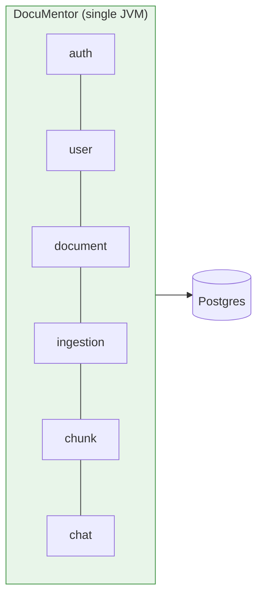

# ADR-001: Monolith over microservices

**Status**: ✅ Accepted
**Date**: 2026-05-13

## Context

DocuMentor has six bounded contexts: auth, user, document, ingestion, chunk/search, and chat. A microservices architecture is one option; a modular monolith is another.

The system has:
- One developer
- No production users (yet)
- No regulatory data-isolation requirements
- A single primary data store (Postgres)

## Decision

Build a **modular monolith**: one deployable Spring Boot application with strict package-level isolation between bounded contexts.

## Alternatives Considered

### Microservices
Split each bounded context into a separate service with its own DB.

**Rejected because**: Adds network calls, distributed tracing, service discovery, schema-replication headaches, and 5–10× operational complexity — for zero benefit at this stage. The number-one architecture mistake at small scale is premature microservices.

### Serverless (Lambda)
Each endpoint as a Lambda function.

**Rejected because**: Cold starts hurt RAG latency. Vector search inside a Lambda needs an external vector DB (defeats ADR-002). Long-running ingestion fits Step Functions awkwardly.

## Consequences

### Positive
- ⚡ Sub-millisecond inter-module calls (function call, not HTTP)
- 🧪 Easier integration tests (one process, one DB)
- 💸 Cheaper to run (one container)
- 🚀 Faster to iterate

### Negative
- 🧱 Risk of becoming a "big ball of mud" if module boundaries blur. *Mitigated by* enforced package structure and ArchUnit tests.
- 📈 Vertical-scaling first; horizontal scaling requires lift-and-shift of the whole app.

## Future migration path

When/if real scale arrives:
1. Extract `ingestion` first — it's already async and queue-friendly.
2. Move `chat` (LLM-call heavy) next.
3. `auth`, `user`, `document` likely stay together as a "core" service.

The bounded-context split makes this extraction mechanical rather than archaeological.
