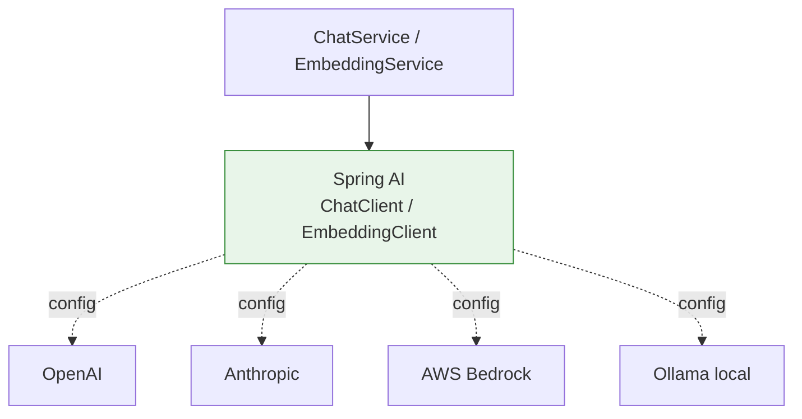

# ADR-003: Spring AI as the LLM client abstraction

**Status**: ✅ Accepted
**Date**: 2026-05-13

## Context

DocuMentor talks to LLMs for two purposes:
1. **Embeddings** — vectorize text chunks and questions
2. **Chat completion** — generate answers from prompts

Options:
- **Spring AI** — first-party Spring framework, multi-provider
- **LangChain4j** — community-driven, more features, larger surface area
- **Direct HTTP** — hand-roll provider SDKs

## Decision

Use **Spring AI 1.0+** with provider abstraction.



## Rationale

### Provider swappability
A single property change switches providers:

```yaml
# application.yml
spring.ai:
  openai:
    api-key: ${OPENAI_API_KEY}
    chat.options.model: gpt-4o-mini
    embedding.options.model: text-embedding-3-small
# OR
  anthropic:
    api-key: ${ANTHROPIC_API_KEY}
    chat.options.model: claude-3-5-haiku-latest
```

Code never imports OpenAI- or Anthropic-specific classes — only `ChatClient` and `EmbeddingClient`.

### Spring-native
- Auto-configuration, properties binding, conditional beans — all the Spring idioms work as expected.
- Integrates cleanly with Spring Boot Actuator (metrics, health) and `@Async`.
- First-class streaming via `Flux<ChatResponse>`.

### Production features included
- Retry/backoff via Resilience4j integration.
- Prompt templates via `PromptTemplate`.
- Structured output via `BeanOutputConverter`.
- Function calling abstraction (we'll use in stretch goals).

## Alternatives — why not?

**LangChain4j**: Excellent project with broader features (more loaders, more memory strategies). Rejected because:
- Larger API surface = more to learn for marginal benefit at this scope.
- Spring AI's auto-config maps better to a Spring Boot project.
- Either tool would let us swap, this is "good enough."

**Direct HTTP / official SDKs**: Pinned to one provider, hand-roll retries, hand-roll streaming. Wastes time.

## Consequences

### Positive
- ⚡ Add a provider in ~5 lines of YAML.
- 🧪 Easy to mock `ChatClient` in tests.
- 📈 Built-in metrics hooks for token tracking.

### Negative
- Spring AI 1.0 is recent; some edges (function calling, structured outputs) still evolving. *Mitigated by* pinning to a known-good release and watching the changelog.
- Less flexibility for novel patterns than hand-rolled SDK code. *Mitigated by* falling back to direct HTTP for one-off cases if needed.
