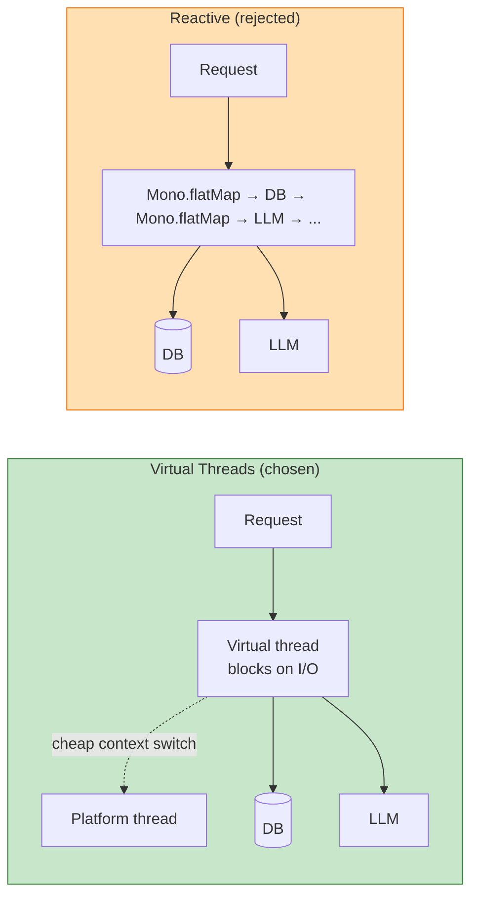

# ADR-004: Virtual threads over reactive stack

**Status**: ✅ Accepted
**Date**: 2026-05-13

## Context

DocuMentor is I/O-bound: most time per request is spent waiting on either Postgres or an LLM API. The Java ecosystem offers two ways to handle high I/O concurrency:

| Approach | Programming model | Cognitive load |
|---|---|---|
| **Virtual threads** (Java 21+) | Synchronous, blocking | Low |
| **Reactive (WebFlux)** | Async, `Mono`/`Flux` | High |

## Decision

Use **Java 21 virtual threads** with a traditional synchronous Spring MVC stack.



## Rationale

### Code readability
```java
// Virtual threads — looks like a regular method
public Answer ask(UUID convId, String question) {
    var history = messageRepo.findByConversation(convId);
    var embedding = embeddingService.embed(question);
    var chunks = vectorSearch.findSimilar(embedding, userId, 5);
    var prompt = promptBuilder.build(history, chunks, question);
    return chatClient.call(prompt);   // blocks; that's fine
}
```

Compare to the reactive equivalent — a pipeline of `flatMap` and `zip` that mixes business logic with stream plumbing.

### No `ThreadLocal` pain
Spring Security, MDC logging, request scope — all rely on `ThreadLocal`. Virtual threads preserve this; reactive pipelines force every value to be carried in the reactive context.

### Adequate concurrency
With virtual threads, blocking on Postgres or OpenAI doesn't pin a platform thread. The JVM can run millions of virtual threads on a small carrier-thread pool — far more concurrency than this app will ever need.

## Alternatives — why not?

**WebFlux (Reactor)**: Better for sustained 100K+ RPS or fan-out-heavy workloads. We're nowhere near that. The complexity tax isn't justified.

**Kotlin Coroutines**: Excellent, but introduces a second language and ecosystem to a portfolio project that's already broad.

## Consequences

### Positive
- Simple, debuggable code.
- Stack traces are real — `jstack` shows what every thread is doing.
- All standard JDBC drivers and HTTP clients "just work."

### Negative
- Synchronized blocks pin virtual threads to their carrier — *mitigated by* using `ReentrantLock` instead.
- Some libraries (older JDBC drivers, third-party SDKs) may still have hidden bottlenecks. *Mitigated by* sticking with HikariCP + modern Postgres driver + Java's HttpClient.

## Configuration

```java
@Configuration
public class AsyncConfig {
    @Bean(name = "applicationTaskExecutor")
    public AsyncTaskExecutor applicationTaskExecutor() {
        return new TaskExecutorAdapter(Executors.newVirtualThreadPerTaskExecutor());
    }
}
```

```properties
spring.threads.virtual.enabled=true
```

That's it — Tomcat and `@Async` both pick this up automatically.
