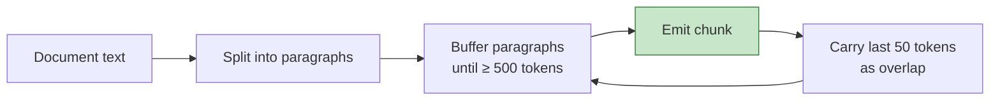

# ADR-005: Token-aware chunking with paragraph preservation

**Status**: ✅ Accepted
**Date**: 2026-05-13

## Context

RAG quality depends heavily on how documents are split. Each chunk becomes a unit of retrieval. Bad chunking → bad retrieval → bad answers, regardless of LLM quality.

Options:

| Strategy | How it splits | Pros | Cons |
|---|---|---|---|
| Fixed character | Every N characters | Simple | Splits mid-sentence, breaks context |
| Fixed token | Every N tokens | Predictable cost/size | Same as above, semantically blind |
| Sentence | At sentence boundaries | Preserves meaning | Variable size, can be too small |
| **Token-aware, paragraph-preserving** | Target N tokens, prefer paragraph breaks | Balanced | More complex |
| Semantic | Cluster by embedding similarity | Best quality | Expensive to compute |

## Decision

**Token-aware sliding window with paragraph preservation:**

- Target chunk size: **500 tokens**
- Overlap between adjacent chunks: **50 tokens** (10%)
- Break preference: paragraph boundary → sentence boundary → token boundary
- Token counter: **jtokkit** (Java port of OpenAI's tiktoken)



## Rationale

### Why 500 tokens?
- Small enough to be granular (multiple chunks per page).
- Large enough to carry real context (not just a snippet).
- Comfortably fits with question + top-K=5 chunks + system prompt within a ~8K context budget on cheap models.

### Why 10% overlap?
Important context that spans a chunk boundary (e.g., "...the result was X. **This was because** of Y...") wouldn't be retrievable from either chunk alone. 10% overlap is the sweet spot — enough to bridge boundaries without massive duplication.

### Why paragraph-first breaking?
A paragraph is a natural semantic unit. Splitting mid-paragraph more often than necessary creates chunks that begin or end mid-thought, which degrades both retrieval (worse embeddings) and answer quality (worse context).

### Why jtokkit?
Character count ≠ token count. The same text encodes differently in different models. jtokkit gives us OpenAI-compatible token counts, so when we say "500 tokens" we mean what OpenAI charges us for.

## Alternatives — why not?

**Fixed character (e.g. LangChain's default)**: Easy but blind to semantics and to token costs. Two chunks of 2000 chars can have wildly different token counts.

**Semantic chunking**: Compute embeddings of small spans, cluster into chunks by similarity. Strictly better quality, but ~10× more embedding calls during ingestion. Worth revisiting in a later phase.

**Sentence-level chunks**: Too granular; loses cross-sentence context that's often essential.

## Consequences

### Positive
- Predictable token costs.
- Better answer quality than character-based chunking (validated by eval harness — see roadmap).
- Boundary-aware: chunks usually start and end at natural breakpoints.

### Negative
- More complex code than naive splitting. *Mitigated by* a 100-line `TextChunker` with thorough unit tests.
- Still suboptimal for documents with unusual structure (tables, code blocks). *Future work*: format-aware chunking.

## Pseudocode

```
chunks = []
buffer = []
buffer_tokens = 0

for paragraph in paragraphs(document):
    p_tokens = count_tokens(paragraph)

    if buffer_tokens + p_tokens > 500:
        # emit current buffer as a chunk
        chunk = join(buffer)
        chunks.append(chunk)
        # carry overlap into next chunk
        buffer = take_last_tokens(chunk, 50)
        buffer_tokens = count_tokens(buffer)

    buffer.append(paragraph)
    buffer_tokens += p_tokens

# Don't forget the tail
if buffer_tokens > 0:
    chunks.append(join(buffer))
```

Edge cases (handled in tests):
- A single paragraph > 500 tokens (split at sentence boundaries within it).
- A document with no paragraphs (treat whole text as one paragraph).
- Empty / whitespace-only documents (reject at upload).
