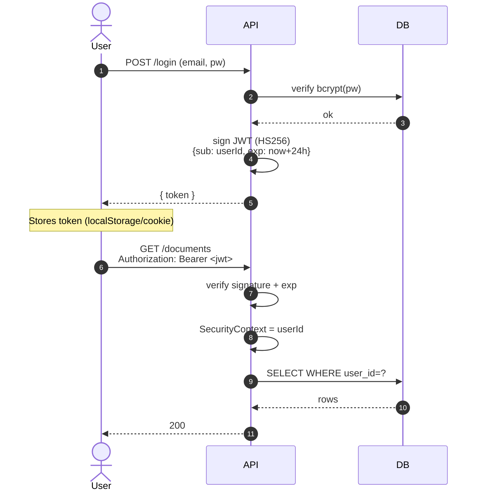

# ADR-006: Stateless JWT authentication

**Status**: ✅ Accepted
**Date**: 2026-05-13

## Context

DocuMentor needs to authenticate users and authorize per-user resource access. Options:

| Approach | State | Trade-off |
|---|---|---|
| **Session cookies** | Server-side | Requires session store (DB/Redis); revocation is easy |
| **JWT (stateless)** | Client-side | Self-contained; revocation is hard |
| **OAuth2 / OIDC delegated** | Provider-side | Best for production; overkill for a portfolio API |

## Decision

**Stateless JWT** (HS256 signed), 24-hour expiry, no refresh token in v1.

## Rationale

### Statelessness fits the architecture
No session store means no Redis just for auth, no sticky sessions, and the API can scale horizontally without coordination.

### Adequate for the use case
This is a personal/portfolio API. We don't have:
- A need to instantly revoke a leaked token across an enterprise.
- Multi-device session management UI.
- SSO requirements.

When those needs arise, we move to OIDC with a real IdP (Cognito/Auth0). Today they don't.

### Industry-standard, well-supported
`spring-boot-starter-security` + `jjwt` is one of the most-trodden paths in Java. Mid-level interviewers expect to see this and ask drill-down questions about it.

## Alternatives — why not?

**Sessions**: Adds a state-store dependency for marginal benefit at this scale.

**OAuth2 / OIDC with Cognito**: Operationally heavier, ties the project to AWS. Will be revisited in Project 3 (fullstack on AWS).

**Refresh tokens**: Worth adding in a later phase. Currently expired tokens just require re-login — acceptable UX for v1.

## Consequences

### Positive
- No state to operate.
- Easy to add tests; tokens are just strings.
- Trivially horizontally scalable.

### Negative
- **Revocation requires waiting for expiry**. *Mitigated by* short 24h expiry; *future work*: token-version column in `users` so we can invalidate by bumping a version.
- **JWT must not be stored in localStorage if XSS is a real risk**. For a portfolio API consumed by Postman/curl/Swagger, this is fine. A real web client should store the token in an HttpOnly cookie.
- **Larger requests** — each call carries ~200 bytes of token. Negligible.

## Security checklist

- [x] Secret key from environment, ≥ 256 bits
- [x] HS256 signing (consider RS256 if multiple services verify)
- [x] Short expiry (24h)
- [x] `exp` claim enforced
- [x] Bcrypt for password hashing (cost factor 12)
- [x] No PII in JWT payload — only `sub` and `iat`/`exp`
- [x] Rate-limited login endpoint (per IP)
- [ ] Refresh tokens (deferred)
- [ ] Token rotation on password change (deferred)