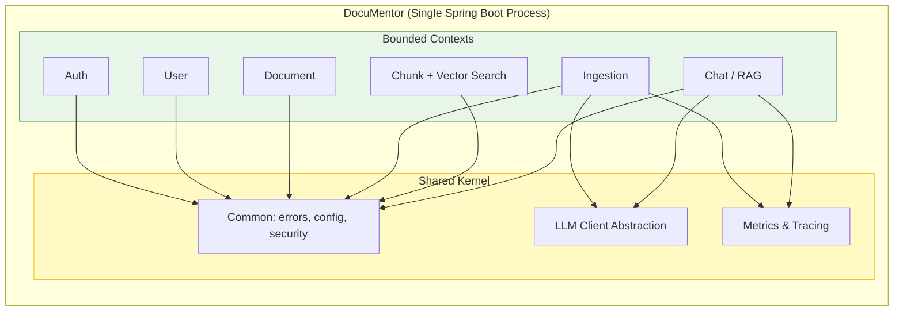
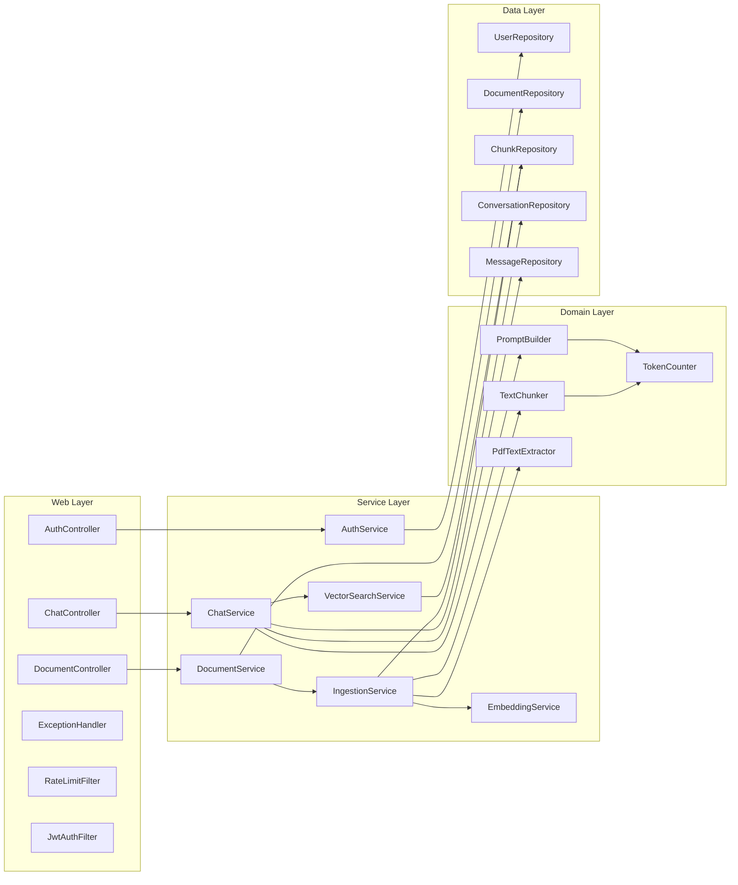
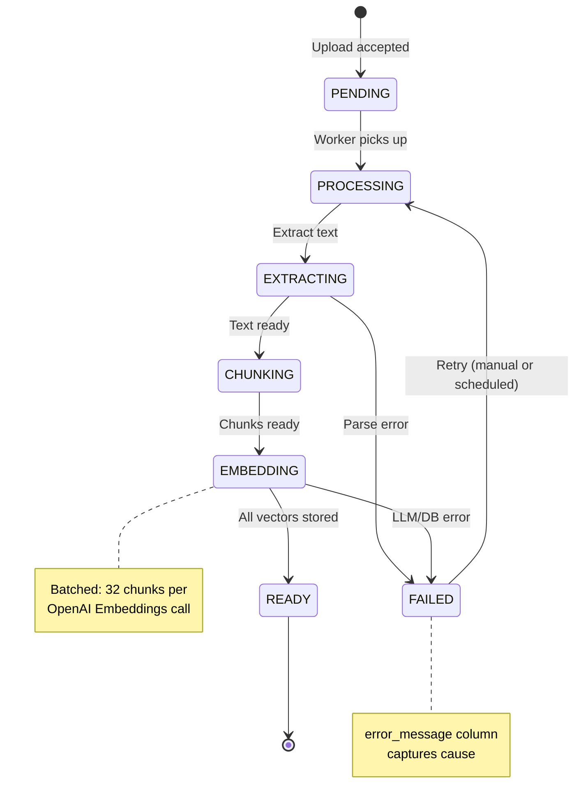
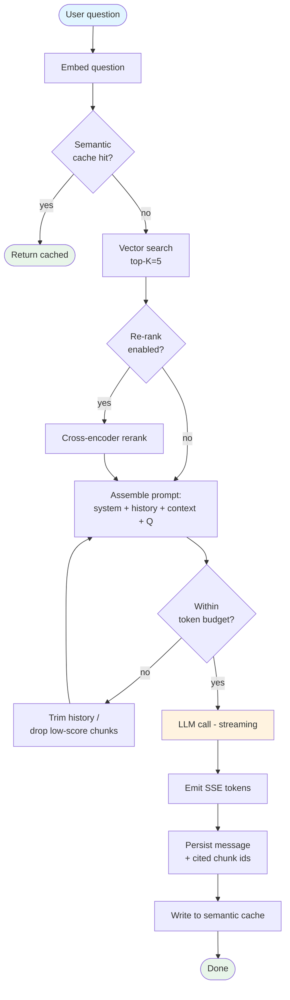
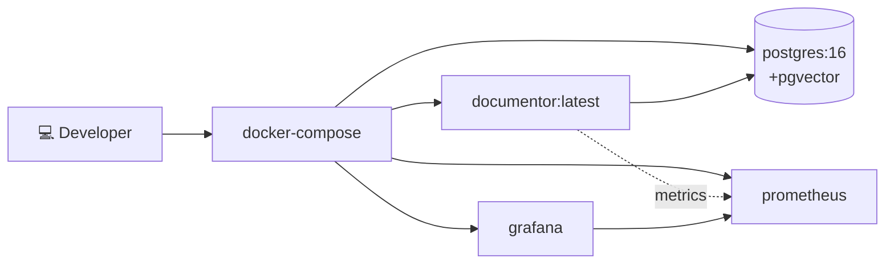
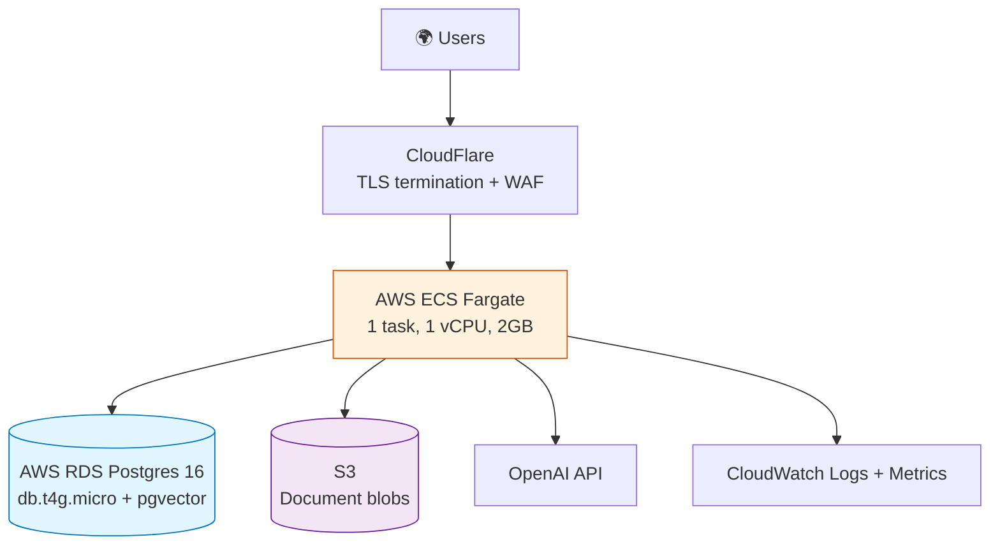
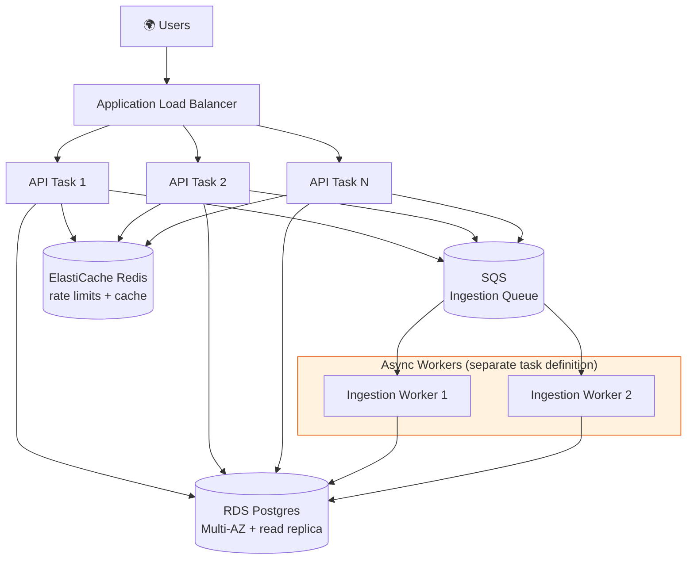
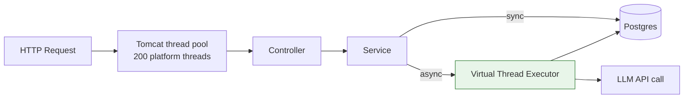

# Architecture

This document describes DocuMentor's architecture in depth: components, runtime behavior, deployment topology, and how the system is designed to evolve.

---

## 1. Architectural Style

DocuMentor is a **modular monolith**. All bounded contexts live in one deployable artifact, but each is isolated by package boundaries and exposes a narrow API to others.

**Why monolith first?** See [ADR-001](adr/001-monolith-over-microservices.md). Short version: a single dev with no production load doesn't need microservices, and a clean monolith *can* be split later if real pressure demands it.

---

## 2. Component Catalog

### Key components

| Component | Responsibility |
|---|---|
| `JwtAuthFilter` | Validates Bearer tokens; sets `SecurityContext`. |
| `RateLimitFilter` | Per-user token bucket via Bucket4j; 429 on exhaustion. |
| `DocumentService` | Orchestrates upload, persists metadata, submits async ingestion. |
| `IngestionService` | Pipeline: extract → chunk → embed → persist. Runs on virtual threads. |
| `PdfTextExtractor` | Wraps Apache Tika + PDFBox; preserves page numbers. |
| `TextChunker` | Token-aware sliding-window chunker; respects paragraph boundaries. |
| `EmbeddingService` | Batched embedding calls via Spring AI. |
| `VectorSearchService` | Native pgvector cosine-similarity search with user-scoped filtering. |
| `ChatService` | RAG orchestration: retrieve → augment → generate → cite. |
| `PromptBuilder` | Builds system/context/history/question messages; centralized for iteration. |

---

## 3. Runtime View — Ingestion Pipeline

### Backpressure & resilience

- **Concurrency limit**: a semaphore caps simultaneous ingestions per user (default 2) to prevent one user from monopolizing the worker pool.
- **Retry policy**: Spring Retry with exponential backoff on transient LLM errors (5xx, 429). Non-retryable on 4xx other than 429.
- **Idempotency**: documents have a `content_hash` (SHA-256 of bytes). Re-uploading the same file returns the existing document instead of duplicating.

---

## 4. Runtime View — RAG Query Pipeline

---

## 5. Deployment Topology

### Local (dev)

### Production (single-node, recommended for portfolio demo)

> 💡 **Cost note**: This stack runs on AWS Free Tier for the first 12 months (RDS db.t4g.micro, Fargate spot, S3 within free tier). For zero-cost demo deployment, use **Fly.io** or **Railway** instead.

### Production (scale-out path)

The path from monolith to this layout: **(1)** Extract async ingestion into its own task definition behind SQS, **(2)** Move rate limits and semantic cache to Redis, **(3)** Add read replica for vector search, **(4)** Horizontally scale API tasks.

---

## 6. Cross-cutting Concerns

### Security

- **Authentication**: Stateless JWT (HS256), 24-hour expiry, refresh endpoint planned.
- **Authorization**: All document/chunk/conversation queries are filtered by `user_id` at the repository layer — *never* trust the path parameter alone.
- **Secrets**: Loaded from environment variables; never logged. `.env` is gitignored.
- **Input validation**: Bean Validation (`@Valid`); file uploads capped at 50 MB; MIME-type sniffed via Tika (not trusted from headers).
- **Prompt injection**: Document content is wrapped in clearly delimited fences in the prompt; the system message instructs the model to treat user-supplied content as data, not instructions. Output is never executed.

### Concurrency model

Long-running ingestion runs on Java 21 **virtual threads** — millions can exist cheaply, and blocking on LLM/DB I/O doesn't pin a platform thread. This is the modern alternative to a reactive stack and keeps the code synchronous/readable.

### Observability

All LLM calls record:

- `llm.latency` (timer, by provider, model, operation)
- `llm.tokens.input` / `llm.tokens.output` (counter)
- `llm.cost.usd` (counter, computed per-model)
- `llm.errors` (counter, by error class)

Plus standard Spring Boot Actuator metrics: HTTP latency, JVM, HikariCP pool, etc.

---

## 7. What's Explicitly Out of Scope (v1)

To keep scope honest:

- ❌ Multi-tenancy at the org level (only per-user isolation)
- ❌ Real-time collaborative chat
- ❌ Document version history
- ❌ Fine-tuning or custom embedding models
- ❌ Mobile push notifications

These are listed because **mid-level engineers know what NOT to build** — and interviewers notice.

---

## 8. Quality Attributes

| Attribute | Target | How it's achieved |
|---|---|---|
| Availability | 99% (demo) | Health checks, graceful shutdown, DB connection retry |
| Query latency | p95 < 4s end-to-end | HNSW index, batched embeddings, streaming first token |
| Ingestion throughput | 10 docs/min sustained | Virtual threads, batched embedding calls |
| Cost | < $0.01 per query | text-embedding-3-small + gpt-4o-mini, semantic cache |
| Recoverability | RPO 24h, RTO 1h | Nightly RDS snapshots, infra as code |

---

See also:
- [Data Model](data-model.md) for schema and indexing
- [API Design](api-design.md) for contracts and errors
- [ADRs](adr/) for the *why* behind every decision
