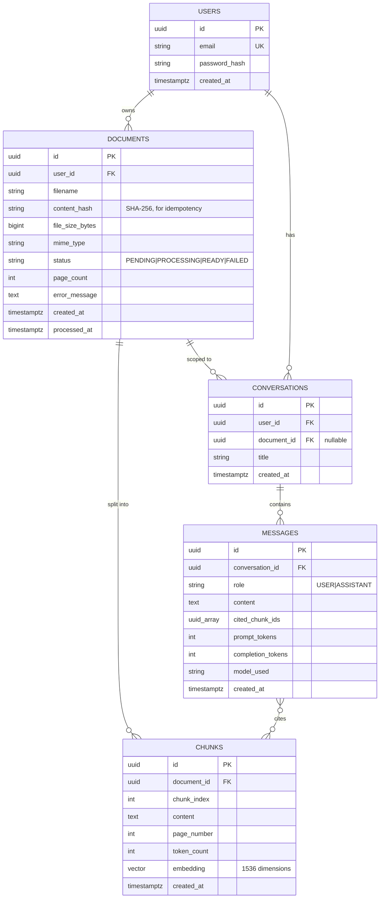
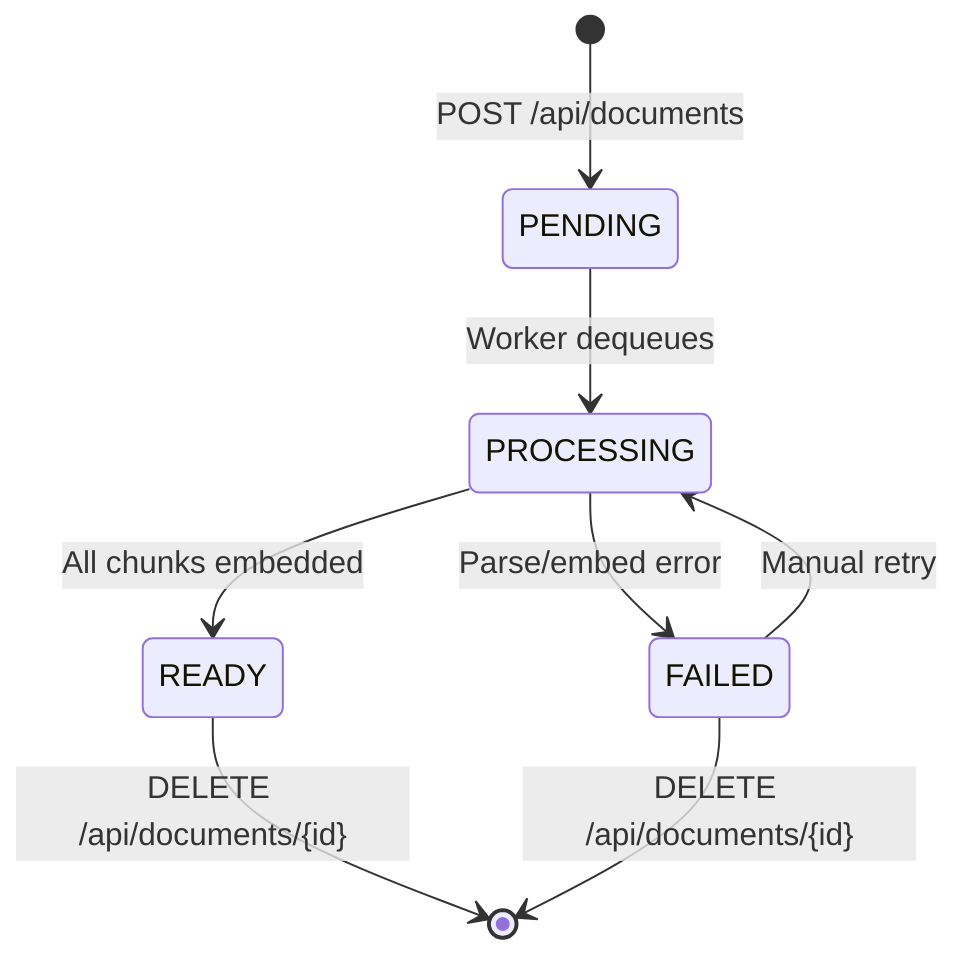
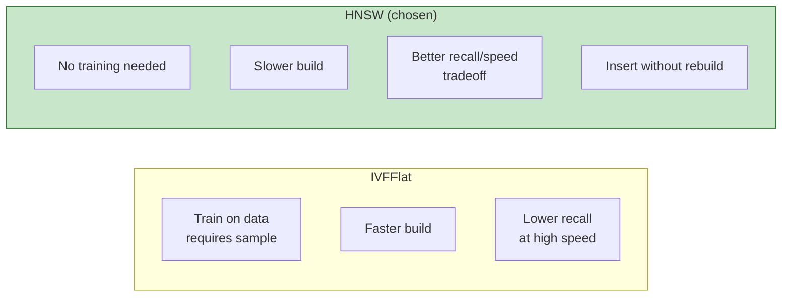

# Data Model

PostgreSQL 16 with the **pgvector** extension is the single source of truth for both relational and vector data.

---

## Entity Relationship Diagram



---

## Lifecycle of a Document



---

## Indexing Strategy

| Table | Index | Type | Reason |
|---|---|---|---|
| `users` | `email` | B-tree (unique) | Login lookup |
| `documents` | `user_id` | B-tree | List documents by user |
| `documents` | `(user_id, content_hash)` | B-tree (unique) | Idempotent uploads |
| `chunks` | `document_id` | B-tree | Cascade delete, debug views |
| `chunks` | `embedding` | **HNSW** (cosine) | Vector similarity search |
| `conversations` | `user_id` | B-tree | List conversations |
| `messages` | `conversation_id` | B-tree | Load history in order |

### Why HNSW over IVFFlat?



For a system with rolling writes (new documents constantly ingested), HNSW's ability to handle incremental inserts without retraining is decisive.

---

## Vector Search Query

The core query that powers RAG:

```sql
SELECT
    c.id,
    c.document_id,
    c.content,
    c.page_number,
    c.chunk_index,
    1 - (c.embedding <=> CAST(:queryEmbedding AS vector)) AS similarity
FROM chunks c
INNER JOIN documents d ON c.document_id = d.id
WHERE d.user_id = :userId
  AND d.status = 'READY'
  AND (:documentId IS NULL OR d.id = :documentId)
ORDER BY c.embedding <=> CAST(:queryEmbedding AS vector)
LIMIT :topK;
```

Notes:
- `<=>` is the cosine-distance operator from pgvector.
- We compute `1 - distance` as similarity (so higher = more similar) for the API response.
- Filtering by `user_id` happens *before* the order-by, ensuring isolation.
- `ORDER BY embedding <=> ...` is what the HNSW index accelerates.

---

## Storage Sizing (back-of-envelope)

For 1,000 users averaging 50 documents each, ~30 pages per doc, ~3 chunks per page:

| Item | Per unit | Total |
|---|---|---|
| Users | ~150 B | 150 KB |
| Documents | ~500 B | 25 MB |
| Chunks (rows) | ~2 KB content | 9 GB |
| Embeddings (1536 × 4B) | ~6 KB | 27 GB |
| **Total Postgres** | | **~36 GB** |

This comfortably fits on db.t4g.small. Storage isn't the bottleneck — *the embedding cost* during ingestion is.

---

## Migration Strategy

All schema lives in `src/main/resources/db/migration/` as Flyway versioned migrations:

```
V1__init.sql                  -- core tables + extensions
V2__add_content_hash.sql      -- idempotent uploads
V3__add_hnsw_index.sql        -- after enough data exists to benefit
V4__add_token_columns.sql     -- per-message token tracking
```

Each migration is **append-only and idempotent**. Schema rollbacks are handled by forward-only repair migrations — never edit a committed migration.
