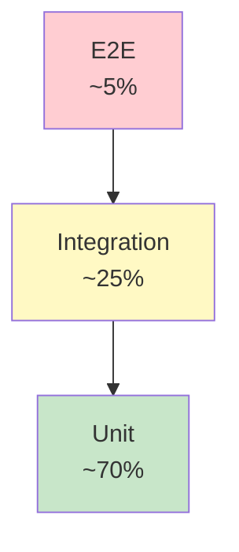
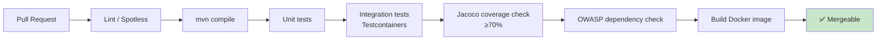

# Development Guide

## Prerequisites

- **Java 21** (use [SDKMAN!](https://sdkman.io/) for easy version management)
- **Docker** & Docker Compose
- **Maven** 3.9+ (or use the included `./mvnw` wrapper)
- An **OpenAI API key** (or Anthropic / a running Ollama)

## First-time setup

```bash
git clone https://github.com/YOURNAME/documentor.git
cd documentor

cp .env.example .env
# Edit .env — add OPENAI_API_KEY at minimum

# Start the full stack
docker-compose up -d

# Wait ~10s for Postgres health check, then verify
curl http://localhost:8080/actuator/health
```

## Project layout

```
documentor/
├── src/main/java/com/yourname/documentor/   ← application code
├── src/main/resources/
│   ├── application.yml                       ← config (profiles: dev, test, prod)
│   └── db/migration/                         ← Flyway SQL
├── src/test/java/...                         ← mirrored test tree
├── docs/                                     ← this folder
├── ops/                                      ← Grafana dashboards, Prometheus config
├── docker-compose.yml
├── Dockerfile
└── pom.xml
```

## Coding conventions

- **Packages by feature**, not by layer (`auth`, `document`, `chat`) — not (`controllers`, `services`).
- **Records** for DTOs and value objects. JPA entities stay as classes (Hibernate needs no-arg constructors).
- **Constructor injection only**. No field `@Autowired`.
- **`@Transactional` on services**, never on controllers or repositories.
- **Errors**: throw a domain-specific exception, handled centrally in `GlobalExceptionHandler` → RFC 7807 response.
- **Logging**: SLF4J with structured fields. Never log secrets, full prompts (PII risk), or raw embedding vectors.

## Testing

```bash
./mvnw test                  # unit tests
./mvnw verify                # + integration tests (Testcontainers)
./mvnw jacoco:report         # coverage at target/site/jacoco/index.html
```

### Test pyramid (target)



### Testcontainers pattern

```java
@Testcontainers
@SpringBootTest
abstract class AbstractIntegrationTest {
    @Container
    @ServiceConnection
    static PostgreSQLContainer<?> postgres =
        new PostgreSQLContainer<>("pgvector/pgvector:pg16");
}
```

All repository/service integration tests extend this. Spring Boot 3.1+'s `@ServiceConnection` wires the connection automatically — no `@DynamicPropertySource` needed.

## Branching & commits

- `main` is always green and deployable.
- Feature branches: `feat/<short-name>`. Fix branches: `fix/<short-name>`.
- **Conventional Commits**: `feat:`, `fix:`, `refactor:`, `docs:`, `test:`, `chore:`.
- Squash-merge PRs into `main`.

## CI

GitHub Actions runs on every PR:



## Common tasks

### Add a new endpoint

1. Add controller method in the relevant bounded context.
2. Add request/response records.
3. Add service method behind it (with `@Transactional` if it mutates).
4. Add MockMvc test + service unit test + (if data path) repository integration test.
5. Document in `docs/api-design.md` if the contract is non-obvious.

### Add a new ADR

1. Copy the format from an existing ADR.
2. Use the next sequential number.
3. Update `docs/adr/README.md`.
4. Link from the main `README.md` decision table.

### Schema change

1. Add a new `Vx__describe.sql` in `db/migration/`. **Never edit a committed migration.**
2. Update JPA entities.
3. Add an integration test that exercises the new column/table.
