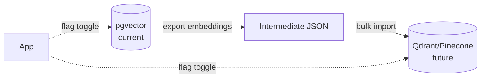

# ADR-002: pgvector over dedicated vector databases

**Status**: ✅ Accepted
**Date**: 2026-05-13

## Context

DocuMentor needs to store and query 1536-dimensional embedding vectors for ~100K–1M chunks. Options:

| Option | Type | Notes |
|---|---|---|
| **pgvector** | Postgres extension | Same DB as relational data |
| **Pinecone** | Managed cloud | Pay per million vectors |
| **Weaviate** | Self-hosted or cloud | Strong but heavy |
| **Qdrant** | Self-hosted or cloud | Lightweight, fast |
| **Milvus** | Self-hosted | Most powerful, also most complex |

## Decision

Use **pgvector**.

## Rationale

```mermaid
graph TB
    subgraph Single["Single DB (pgvector)"]
        APP1[Spring Boot] --> PG[(Postgres + pgvector)]
        PG -.- TX[ACID across<br/>relational + vector]
    end

    subgraph Dual["Two DBs (Pinecone + Postgres)"]
        APP2[Spring Boot] --> PG2[(Postgres)]
        APP2 --> PC[(Pinecone)]
        PG2 -.x.- PC
        EVENT[Eventual consistency<br/>between stores]
    end

    style Single fill:#c8e6c9,stroke:#2e7d32
    style Dual fill:#ffcdd2,stroke:#c62828
```

### Operational simplicity
One database = one backup target, one connection pool, one place to debug, one place that can fail. For a portfolio project, this is decisive.

### Transactional consistency
When a document is deleted, its chunks (and embeddings) must go with it. With pgvector, this is a single SQL `ON DELETE CASCADE`. With Pinecone, it's a two-phase delete with risk of orphaned vectors.

### Cost
- pgvector on RDS db.t4g.small: ~$15/mo for everything.
- Pinecone Starter: free up to a limit, then $70+/mo. Plus the Postgres bill for relational data.

### Performance
With HNSW indexes (pgvector ≥ 0.5), p95 query latency on 1M vectors is <50 ms on modest hardware. Sufficient for RAG, where the LLM call dominates total response time anyway.

## Alternatives — why not?

**Pinecone**: Best-in-class for raw scale, but adds a second data store, network hop, and recurring cost. Worth it at 100M+ vectors; not at 1M.

**Qdrant**: Strong contender. Open-source, fast, nice API. *Could* be a future migration if pgvector hits limits. But adds another component to operate.

**Weaviate / Milvus**: Overkill in features and operational weight.

## Consequences

### Positive
- Single source of truth.
- ACID transactions span relational + vector data.
- Familiar tooling (psql, pgAdmin, Flyway).
- Cheap.

### Negative
- pgvector tops out around 10–100M vectors before query latency or write throughput degrades. We won't hit that.
- HNSW index build during high write volume can be CPU-heavy. *Mitigated by* batched async ingestion.

## Migration path (if needed)



Hide the vector store behind `VectorSearchService` so swapping the backend is a one-class change, not a rewrite.
