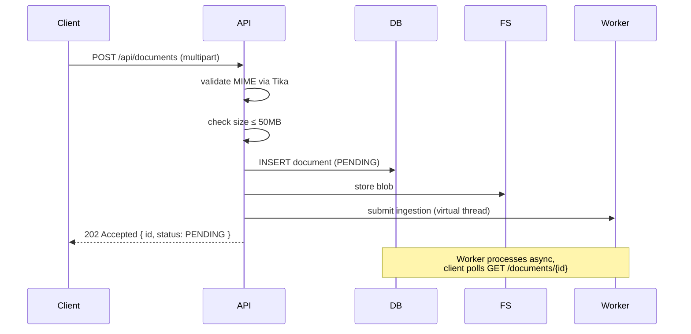
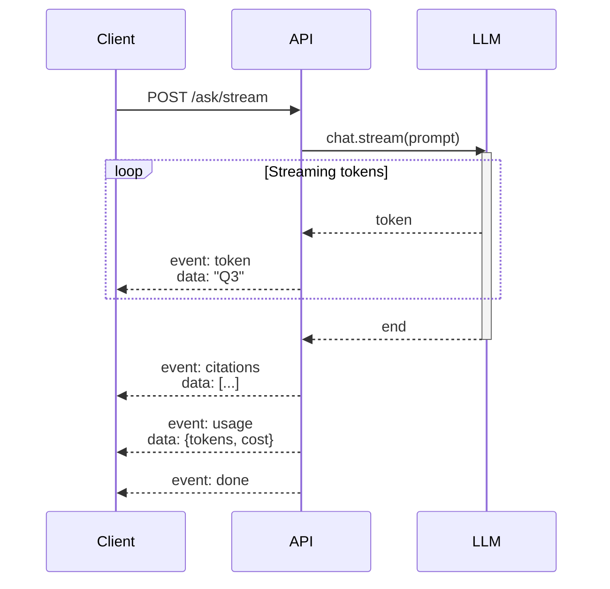
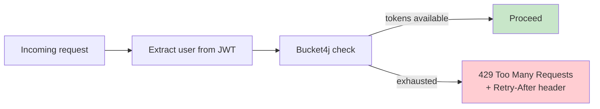

# API Design

DocuMentor exposes a REST + SSE API. All routes are documented at runtime via OpenAPI 3 / Swagger UI at `/swagger-ui.html`.

---

## Conventions

- **Base path**: `/api`
- **Auth**: `Authorization: Bearer <jwt>` on every non-auth route
- **Content type**: `application/json` (multipart for uploads, `text/event-stream` for streams)
- **IDs**: UUID v4 throughout
- **Errors**: RFC 7807 Problem Details
- **Pagination**: `?page=0&size=20`; responses include `Page<T>` envelope

---

## Resource map

```mermaid
graph LR
    USER([👤 User]) --> AUTH[/api/auth]
    USER --> DOCS[/api/documents]
    USER --> CONV[/api/conversations]
    DOCS --> CHUNKS["{id}/chunks (debug)"]
    CONV --> MSGS["{id}/messages"]
    CONV --> ASK["{id}/ask"]
    CONV --> STREAM["{id}/ask/stream"]

    style AUTH fill:#fff3e0
    style ASK fill:#e8f5e9
    style STREAM fill:#e8f5e9
```

---

## Auth

### `POST /api/auth/register`

```json
// Request
{ "email": "user@example.com", "password": "strong-password-12" }

// 201 Created
{ "token": "eyJhbGc...", "userId": "uuid", "expiresAt": "2026-05-14T..." }
```

### `POST /api/auth/login`
Same request shape; returns same response on success.

---

## Documents

### `POST /api/documents`
Multipart upload. Returns immediately with `PENDING` status.



```json
// 202 Accepted
{
  "id": "uuid",
  "filename": "research.pdf",
  "status": "PENDING",
  "uploadedAt": "2026-05-13T..."
}
```

### `GET /api/documents/{id}`

```json
{
  "id": "uuid",
  "filename": "research.pdf",
  "status": "READY",
  "pageCount": 42,
  "chunkCount": 156,
  "uploadedAt": "...",
  "processedAt": "..."
}
```

### `GET /api/documents`
Paginated list. Filterable by status: `?status=READY`.

### `DELETE /api/documents/{id}`
Cascade-deletes document, chunks, and blob. Returns 204.

---

## Conversations & Q&A

### `POST /api/conversations`

```json
// Request (documentId optional — null means search across all docs)
{ "title": "Q3 report analysis", "documentId": "uuid" }

// 201 Created
{ "id": "uuid", "title": "...", "documentId": "uuid", "createdAt": "..." }
```

### `POST /api/conversations/{id}/ask` (blocking)

```json
// Request
{ "question": "What were the key revenue drivers in Q3?" }

// 200 OK
{
  "answer": "Q3 revenue was driven by three factors: ...",
  "citations": [
    { "chunkId": "uuid", "documentId": "uuid", "page": 4, "snippet": "..." },
    { "chunkId": "uuid", "documentId": "uuid", "page": 7, "snippet": "..." }
  ],
  "usage": {
    "promptTokens": 1842,
    "completionTokens": 213,
    "model": "gpt-4o-mini",
    "estimatedCostUsd": 0.0008
  }
}
```

### `POST /api/conversations/{id}/ask/stream` (SSE)



Event stream:

```
event: token
data: "Q3 "

event: token
data: "revenue "

event: token
data: "was "

...

event: citations
data: [{"chunkId":"...","page":4,"snippet":"..."}, ...]

event: usage
data: {"promptTokens":1842,"completionTokens":213,"model":"gpt-4o-mini"}

event: done
data: {}
```

---

## Error Responses (RFC 7807)

All errors follow [Problem Details](https://datatracker.ietf.org/doc/html/rfc7807):

```json
{
  "type": "https://documentor.dev/errors/document-not-ready",
  "title": "Document not ready",
  "status": 409,
  "detail": "Document a1b2... is still PROCESSING. Try again in a few seconds.",
  "instance": "/api/conversations/x/ask",
  "documentId": "a1b2..."
}
```

### Error catalog

| Status | Type | When |
|---|---|---|
| 400 | `validation-failed` | Bean Validation errors |
| 401 | `unauthorized` | Missing/invalid JWT |
| 403 | `forbidden` | Resource owned by another user |
| 404 | `not-found` | Resource doesn't exist |
| 409 | `document-not-ready` | Asking before ingestion completes |
| 413 | `file-too-large` | Upload > 50 MB |
| 415 | `unsupported-media-type` | MIME not in allowlist |
| 429 | `rate-limited` | Per-user bucket exhausted |
| 500 | `internal-error` | Unhandled exception |
| 502 | `llm-upstream-error` | LLM provider failure after retries |
| 503 | `service-unavailable` | DB unreachable, etc. |

---

## Rate Limits



| Bucket | Capacity | Refill |
|---|---|---|
| LLM queries (`/ask`, `/ask/stream`) | 30 | 30 per minute |
| Uploads | 20 | 20 per hour |
| Auth (login/register) | 10 | 10 per minute, per IP |

---

## Versioning

URL-based: `/api/v1/...` introduced when a breaking change is unavoidable.
Backwards-compatible additions (new fields, new endpoints) ship on the existing version.
