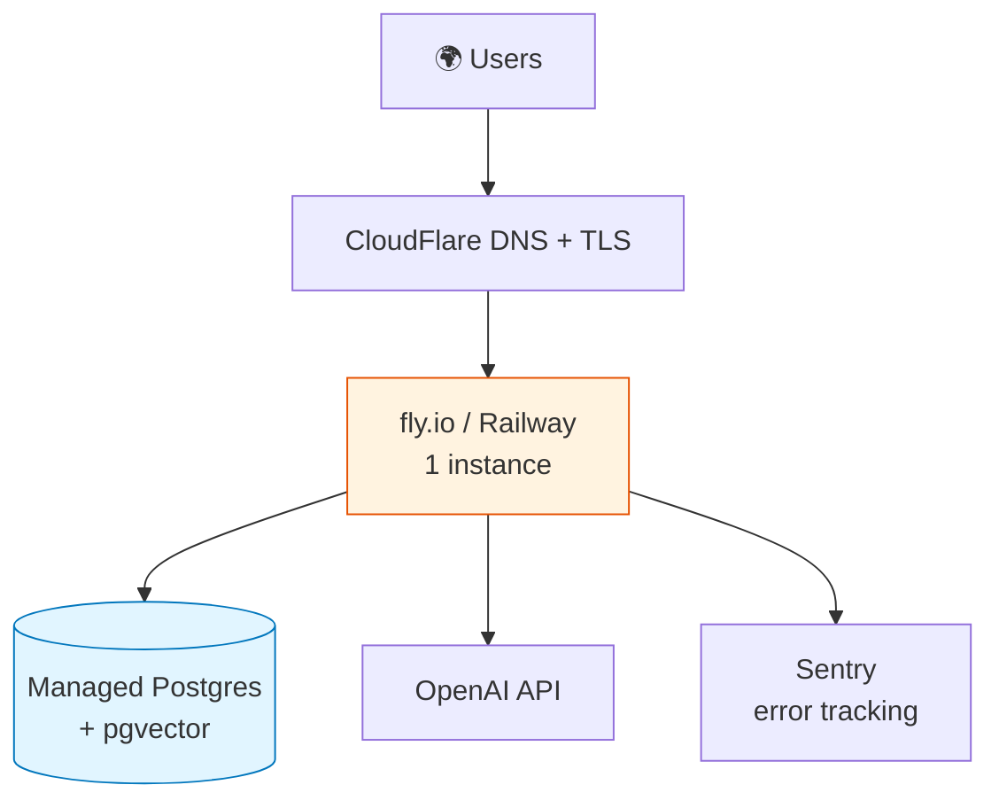
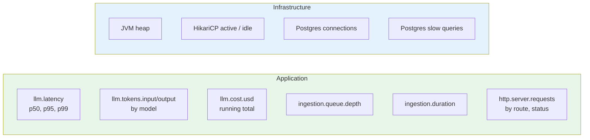

# Operations

## Deployment topology (recommended for portfolio demo)



Either Fly.io or Railway hits a free/cheap tier and supports the pgvector extension on their managed Postgres.

## Environment variables

| Variable | Required | Example |
|---|---|---|
| `OPENAI_API_KEY` | If using OpenAI | `sk-...` |
| `ANTHROPIC_API_KEY` | If using Anthropic | `sk-ant-...` |
| `SPRING_AI_PROVIDER` | Yes | `openai` / `anthropic` / `ollama` |
| `DB_URL` | Yes | `jdbc:postgresql://host:5432/documentor` |
| `DB_USER` | Yes | `documentor` |
| `DB_PASSWORD` | Yes | (secret) |
| `JWT_SECRET` | Yes | ≥ 256-bit random |
| `JWT_EXPIRY_HOURS` | No | `24` |
| `STORAGE_BACKEND` | No | `local` / `s3` |
| `S3_BUCKET` | If `STORAGE_BACKEND=s3` | `documentor-blobs` |

## Health checks

| Endpoint | Purpose |
|---|---|
| `/actuator/health/liveness` | Process is alive — minimal check |
| `/actuator/health/readiness` | Process can serve traffic — checks DB + LLM provider |
| `/actuator/info` | Build version, git commit |
| `/actuator/prometheus` | Metrics scrape endpoint |

## Metrics to watch



## Alerting (when this matters in prod)

| Condition | Severity | Action |
|---|---|---|
| `llm.latency.p95 > 10s` for 5min | Warning | Check provider status, fall back to alt model |
| `ingestion.queue.depth > 100` for 10min | Warning | Scale worker, investigate stuck items |
| `llm.errors.rate > 5%` for 5min | Critical | Provider outage suspected, page on-call |
| `db.connections.used / max > 0.9` | Critical | Pool exhausted, investigate slow queries |
| `http.5xx.rate > 1%` for 5min | Critical | Bug or downstream failure |

## Runbooks

### Postgres connection pool exhausted

**Symptoms**: 5xx spike, `HikariPool-1 - Connection is not available` in logs.

**Investigate**:
1. Check active queries: `SELECT pid, age(clock_timestamp(), query_start), query FROM pg_stat_activity WHERE state='active' ORDER BY 2 DESC;`
2. Look for long-held transactions (probably a `@Transactional` method blocking on an LLM call — a known anti-pattern; LLM calls should be outside transactions).
3. Cancel offending queries: `SELECT pg_cancel_backend(pid);`

**Resolve**: Refactor offending service to release transaction before LLM call.

### LLM provider outage

**Symptoms**: `502 llm-upstream-error` spike, `llm.errors` metric rising.

**Investigate**:
1. Check provider status page.
2. Check `llm.errors` breakdown by error class.

**Resolve**: Switch `SPRING_AI_PROVIDER` env var to a working provider and redeploy (or use feature flag if implemented).

### Stuck `PROCESSING` documents

**Symptoms**: Documents sit in `PROCESSING` state > 5 minutes.

**Investigate**:
1. Check logs for worker exceptions on those document IDs.
2. Check `documents.error_message`.

**Resolve**: 
- Transient: `UPDATE documents SET status='PENDING' WHERE id IN (...);` — worker will retry.
- Persistent (e.g., malformed PDF): mark `FAILED` with descriptive error message.

## Backups

- **RDS**: automated daily snapshots, 7-day retention.
- **S3 / object storage**: versioning enabled, lifecycle to Glacier after 30 days.
- **Restore drill**: documented quarterly.

## Cost tracking

The `llm.cost.usd` Prometheus counter accumulates per-request cost based on a model-rate table in `application.yml`. Aggregate to a Grafana panel and set a monthly budget alert.

```yaml
documentor:
  pricing:
    openai:
      gpt-4o-mini:
        input-per-million: 0.15
        output-per-million: 0.60
      text-embedding-3-small:
        per-million: 0.02
```

Update when providers change pricing.
